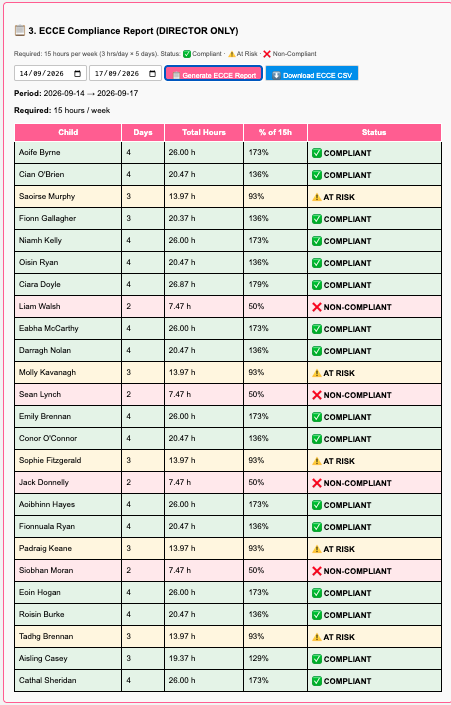
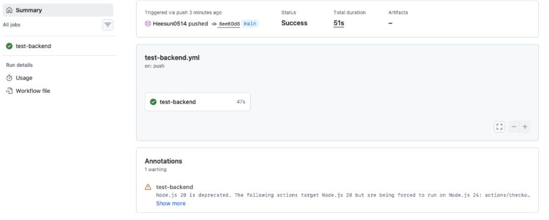
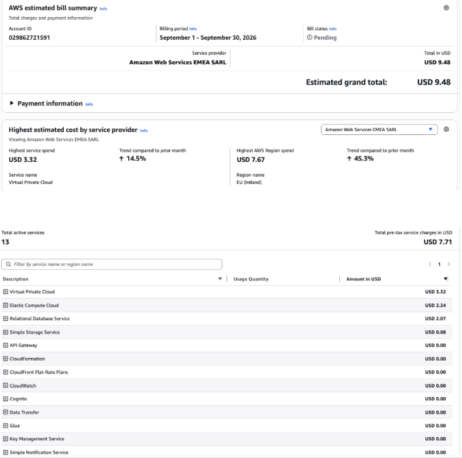

# 🏫 Daycare Digital Logbook - AWS Cloud Migration

A professional attendance management system for daycare centers with **ECCE compliance tracking**, built with modern cloud technologies.

---

## ⭐ Project Highlights

- Migrated 11 children and 3 attendance records from SQLite to AWS RDS PostgreSQL without data loss
- Built a stateless Node.js Express API with JWT authentication
- Implemented AWS Cognito with Teacher and Director role-based access
- Wrote 17 Jest/Supertest integration tests, run automatically in GitHub Actions
- Built an ECCE compliance report for Irish daycare funding
- Deployed the frontend to CloudFront + S3
- Measured test coverage with Jest: 55.15% statements (lowest in auth.js; see Section 5.7.1 of the report)
- Cost: ~$24.48 over three months, well under the $30–40/month budget

## 📸 Screenshots

### Teacher Dashboard


*Single table of all 25 children with live status badges and contextual Check In / Check Out / Edit buttons.*


### ECCE Compliance Report


*Weekly compliance report for 25 children showing COMPLIANT, AT RISK, and NON-COMPLIANT statuses.*

### Architecture


*Four-tier AWS architecture: CloudFront + S3, Cognito, Elastic Beanstalk, and RDS PostgreSQL.*
*The backend API is not yet deployed to AWS. It runs locally and connects to the RDS instance over the internet. See "Deployment Decisions & Trade-offs" below.*

### CI Pipeline


*GitHub Actions workflow running the Jest/Supertest integration suite against a temporary PostgreSQL service.*

### AWS Billing


*Total AWS spend over three months: ~$24.48.*


## 🎯 Project Overview

This project is a **cloud-based attendance and compliance tracking system** designed for Irish daycare centers receiving government **ECCE (Early Childhood Care and Education)** funding. It manages daily check-in/check-out operations and automatically calculates compliance with funding requirements.

The live system holds **25 registered children**  and a seeded set of attendance records, producing a realistic dataset for testing the ECCE compliance report

### Key Goals

- ✅ Migrate from local SQLite to cloud-based PostgreSQL (AWS RDS)
- ✅ Implement secure AWS Cognito authentication
- ✅ Deploy frontend on CloudFront + S3
- ✅ Validate backend locally with production frontend
- ✅ Track ECCE compliance (15 hours/week minimum)
- ✅ Provide role-based access (Teacher, Director, Parent)

---

## ✨ Features

### For Teachers

- 📋 **Attendance Table** – All registered children displayed in a single table
- 👶 **One-tap Check In** – Click "➕ Check In Now" to create an attendance record
- 🚪 **One-tap Check Out** – Click "🚪 Check Out Now" to record departure
- ✏️ **Inline Edit** – Click "✏️ Edit" on any row to pre-fill the edit form
- 📊 **Live Status** – Colour-coded status badge per child
  - ⚪ Not arrived
  - 🟢 Present
  - 🔴 Departed
- 🔄 **Auto-refresh** – Table refreshes after every action

### For Directors

- 🔍 **All Teacher Features** (check-in, check-out, edit)
- 📈 **ECCE Compliance Reports** – Track hours per child, compliance status
- 🎨 **Colour-coded Status**
  - ✅ **Compliant** (≥ 15 hours/week)
  - ⚠️ **At Risk** (10–14 hours)
  - ❌ **Non-Compliant** (< 10 hours)
- 📥 **Download ECCE CSV** – Export compliance data for audits

### For Parents

- 👨‍👩‍👧 **View Child Status** – Read-only lookup on the login page. Enter the registered parent email to view that child's attendance for the current day.
- 🔓 **No login required** – Uses the public `GET /api/parent/status` endpoint.
- 🔐 **Production note** – The endpoint accepts an email parameter and is vulnerable to enumeration. A production version would use a one-time verification code.

## 🛠 Technology Stack

### Frontend

- **Framework**: Vanilla JavaScript (ES6+)
- **UI**: HTML5 + CSS3
- **Hosting**: AWS CloudFront + S3 (static)
- **State**: In-memory + localStorage for tokens

### Backend

- **Runtime**: Node.js 18
- **Framework**: Express.js 4.x
- **ORM**: Sequelize 6.x
- **Authentication**: AWS Cognito + JWT
- **Hosting**: Local development (validated for production-ready code)

### Database

- **Type**: PostgreSQL 15
- **Hosting**: AWS RDS
- **Tables**: `children`, `attendance`
- **Relationships**: One-to-Many (Child → Attendance)

### Infrastructure

- **CDN**: CloudFront (`d2d7c2s58id62i.cloudfront.net`)
- **Storage**: S3 (`daycare-frontend-huiseon`)
- **Database**: AWS RDS (PostgreSQL, eu-west-1)
- **Auth**: AWS Cognito (User Pool `eu-west-1_h8W0npweg`)

---

## 🏗 Architecture

### Current Architecture

```text
┌─────────────────────────────────────────────────────────────────┐
│                          AWS Cloud                              │
├─────────────────────────────────────────────────────────────────┤
│                                                                 │
│   ┌──────────────────────┐      ┌──────────────────────────┐    │
│   │   CloudFront CDN     │      │      AWS Cognito         │    │
│   │  (Frontend, HTTPS)   │◄─────┤    (Authentication)      │    │
│   │  d2d7c2s58id62i...   │      │   (JWT Token Issuer)     │    │
│   └──────────────────────┘      └──────────────────────────┘    │
│              ▲                                                  │
│              │                                                  │
│              ▼                                                  │
│   ┌──────────────────────────┐                                  │
│   │   Node.js Express API    │                                  │
│   │   (Validated locally)    │                                  │
│   │   Port: 8080             │                                  │
│   │   EB deployment: see 5.8 │                                  │
│   └──────────────────────────┘                                  │
│              │                                                  │
│              ▼                                                  │
│   ┌──────────────────────────┐                                  │
│   │        AWS RDS           │                                  │
│   │      PostgreSQL          │                                  │
│   │  (children, attendance)  │                                  │
│   └──────────────────────────┘                                  │
│                                                                 │
└─────────────────────────────────────────────────────────────────┘

┌─────────────────────────────────┐
│      Local Development          │
├─────────────────────────────────┤
│ ├─ Backend:  localhost:8080     │
│ ├─ Frontend: CloudFront URL     │
│ └─ Database: RDS (remote)       │
└─────────────────────────────────┘
```

---

## 📦 Installation & Setup

### Prerequisites

- Node.js 18+ and npm
- PostgreSQL client (`psql`)
- Git
- AWS Account (for cloud deployment)
- Cognito User Pool setup

### Backend Setup

```bash
# 1. Clone the repository
git clone https://github.com/Heesun0514/Daycare-Digital-Logbook-AWS-Cloud-Migration.git
cd Daycare-Digital-Logbook-AWS-Cloud-Migration/backend

# 2. Install dependencies
npm install

# 3. Create .env file with your credentials
cat > .env << EOF
# Database (AWS RDS)
DB_HOST=your-rds-endpoint.eu-west-1.rds.amazonaws.com
DB_PORT=5432
DB_USER=postgres
DB_PASSWORD=your_secure_password
DB_NAME=daycare_db

# Cognito
COGNITO_REGION=eu-west-1
COGNITO_USER_POOL_ID=eu-west-1_h8W0npweg
COGNITO_CLIENT_ID=your_client_id
COGNITO_CLIENT_SECRET=your_client_secret

# JWT
JWT_SECRET=your_jwt_secret_key

# Server
PORT=8080
NODE_ENV=development
EOF

# 4. Run the server
node server.js
# 🚀 Server running on http://localhost:8080
```

### Frontend Setup

The frontend is deployed to S3 + CloudFront. To update it:

```bash
cd ../frontend

# Deploy to S3
aws s3 cp index.html s3://daycare-frontend-huiseon/index.html
aws s3 cp app.js     s3://daycare-frontend-huiseon/app.js

# Invalidate CloudFront cache
aws cloudfront create-invalidation \
  --distribution-id E2ZISHE6S9U5HN \
  --paths "/*"
```

**Live URL:** https://d2d7c2s58id62i.cloudfront.net

For local development: open `index.html` in a browser while the backend runs on `localhost:8080`.

### Database Setup

The database is already seeded with 25 children. To reset:

```bash
cd backend

# Wipe all data
node delete-all-children.js

# Seed 25 children
node seed-25-children.js

# Seed a week of attendance for the ECCE report
node seed-week-attendance.js
```

---

## 🗄 Database Schema

### Children Table

```sql
CREATE TABLE children (
    id SERIAL PRIMARY KEY,
    child_name VARCHAR(255) UNIQUE NOT NULL,
    parent_email VARCHAR(255) NOT NULL,
    created_at TIMESTAMP DEFAULT NOW()
);
```

**Example Data:**

| id | child_name | parent_email |
|----|------------|--------------|
| 1 | Aoife Byrne | aoife.byrne@example.ie |
| 2 | Cian O'Brien | cian.obrien@example.ie |
| 3 | Saoirse Murphy | saoirse.murphy@example.ie |
| 4 | Fionn Gallagher | fionn.gallagher@example.ie |
| 5 | Niamh Kelly | niamh.kelly@example.ie |

### Attendance Table

```sql
CREATE TABLE attendance (
    id SERIAL PRIMARY KEY,
    child_id INTEGER NOT NULL REFERENCES children(id),
    child_name VARCHAR(255) NOT NULL,
    parent_email VARCHAR(255),
    arrival_time VARCHAR(5),
    departure_time VARCHAR(5),
    date VARCHAR(10)
);
```

**Example Data:**

| id | child_id | child_name | arrival_time | departure_time | date |
|----|----------|------------|--------------|----------------|------|
| 1 | 1 | Aoife Byrne | 08:30 | 15:00 | 2026-09-15 |
| 2 | 2 | Cian O'Brien | 09:00 | 15:30 | 2026-09-15 |
| 3 | 3 | Saoirse Murphy | 09:00 | 15:30 | 2026-09-15 |

---

## 🔌 API Endpoints

### Authentication

```http
POST /api/auth/login
    - Body: { email, password }
    - Response: { success, token, idToken, accessToken, email, role, message }
    - Auth: None (public)
    - Uses Cognito USER_PASSWORD_AUTH with SECRET_HASH
    - Returns the internal application JWT (`token`) plus the Cognito IdToken and AccessToken
      (see Appendix C of the final report for the full handler)

GET /api/auth/me
- Response: { user, message }
- Auth: JWT Bearer Token
```

### Attendance

```http
POST /api/attendance/checkin
- Body: { child_id, child_name, parent_email, arrival_time, date }
- Response: { success, id, child_name }
- Auth: Required (Teacher or Director)
- Rejects duplicate check-ins for the same child on the same day

PUT /api/attendance/checkout/:id
- Body: { departure_time }
- Response: { success, id, departure_time }
- Auth: Required (Teacher or Director)
- Rejects check-out if record already has a departure_time

PUT /api/attendance/:id
- Body: { arrival_time?, departure_time?, date? }
- Response: { success, message, record }
- Auth: Required (Teacher or Director)
```

### Reports

```http
GET /api/attendance/report
- Query: ?from=YYYY-MM-DD&to=YYYY-MM-DD
- Response: { success, message, record: [...] }
- Auth: Required (Teacher or Director)

GET /api/attendance/ecce-report
- Query: ?from=YYYY-MM-DD&to=YYYY-MM-DD
- Response: { success, period, required_hours, report: [...] }
- Auth: Required (Director only — Teachers receive 403)
```

### Children

```http
GET /api/children
- Response: { success, children: [{ id, child_name, parent_email }, ...] }
- Auth: Required (Teacher or Director)
```
### Parent (Public)

```http
GET /api/parent/status
- Query: ?email=parent@example.ie&date=YYYY-MM-DD (date optional; defaults to today)
- Response: { success, email, date, records: [...] }
- Auth: None (public)
- Returns only records matching the supplied parent email
```

### Health Check

```http
GET /health
- Response: { status: "Healthy", database: "Connected" }
- Auth: None (public)
```

---

## 👥 User Roles & Access Control

### Teacher

- **Attendance Table** – All registered children displayed in a single table
- **One-tap Check In** – Click "➕ Check In Now" next to a child
- **One-tap Check Out** – Click "🚪 Check Out Now" to record departure
- **Inline Edit** – Click "✏️ Edit" on any row to pre-fill the edit form
- **Live Status** – Colour-coded status badge per child
- **No access** to ECCE compliance report

### Director

- ✅ All Teacher features
- ✅ Access to the ECCE Compliance Report section
- ✅ Generate ECCE compliance reports for a date range
- ✅ Download ECCE CSV exports

### Parent

- ✅ Read-only lookup on the login page (no login required)
- ✅ Calls the public `GET /api/parent/status` endpoint
- ⚠️ Accepts an email parameter — a production version would use email verification

---

## 📊 ECCE Compliance Tracking

### What is ECCE?

**ECCE (Early Childhood Care and Education)** is an Irish government program providing childcare funding. To qualify:

| Requirement | Duration | Hours/Week |
|-------------|----------|------------|
| Daily attendance | 3 hours/day | 15 hours/week minimum |
| Weekly schedule | 5 days/week | Mon–Fri |
| Annual target | 38 weeks/year | 570 hours/year |

### Compliance Status

**Status Calculation:**

```javascript
// For a given week (or date range)
const totalHours = sumOf(attendance records);

if (totalHours >= 15)      status = 'COMPLIANT';
else if (totalHours >= 10) status = 'AT RISK';
else                       status = 'NON-COMPLIANT';
```

| Status | Threshold | Meaning |
|--------|-----------|---------|
| ✅ COMPLIANT | ≥ 15 hours | Fully eligible for ECCE funding |
| ⚠️ AT RISK | 10–14 hours | Below threshold — intervention needed |
| ❌ NON-COMPLIANT | < 10 hours | Does not meet funding requirements |

### Demo Dataset

The seed script assigns each of the 25 children to one of four weekly attendance patterns (`index % 4`):

| Pattern | Days | Daily Hours | Weekly Total | Result |
|---------|------|-------------|--------------|--------|
| A | 5 | 6.5 | 32.5 | ✅ COMPLIANT |
| B | 3 | 6.5 | 19.5 | ✅ COMPLIANT |
| C | 2 | 6.5 | 13.0 | ⚠️ AT RISK |
| D | 1 | 6.5 | 6.5 | ❌ NON-COMPLIANT |

Distribution across the 25-child dataset:

| Status | Children | Percentage |
|--------|----------|------------|
| ✅ COMPLIANT | 16 | 64% |
| ⚠️ AT RISK | 5 | 20% |
| ❌ NON-COMPLIANT | 4 | 16% |

### Example Report

**Period:** Monday to Friday of the current week
**Required:** 15 hours/week

| Child | Days | Hours | % of 15h | Status |
|-------|------|-------|----------|--------|
| Aoife Byrne | 4 | 26.00 | 173% | ✅ COMPLIANT |
| Cian O'Brien | 4 | 26.47 | 176% | ✅ COMPLIANT |
| Saoirse Murphy | 3 | 13.07 | 87% | ⚠️ AT RISK |
| Fionn Gallagher | 3 | 20.37 | 136% | ✅ COMPLIANT |
| Liam Walsh | 2 | 7.47 | 50% | ❌ NON-COMPLIANT |

---

## 🚀 Deployment

### Current Setup: Local Backend + CloudFront Frontend

#### Development

```bash
# Terminal 1: Start Backend (localhost:8080)
cd backend
node server.js

# Browser: open the CloudFront URL
# https://d2d7c2s58id62i.cloudfront.net

# Login credentials (Cognito)
# Teacher:  teacher@daycare.local
# Director: director@daycare.local
```

#### Deploying Updates to the Frontend

```bash
cd frontend

aws s3 cp index.html s3://daycare-frontend-huiseon/index.html
aws s3 cp app.js     s3://daycare-frontend-huiseon/app.js

aws cloudfront create-invalidation \
  --distribution-id E2ZISHE6S9U5HN \
  --paths "/*"

# Verify health of backend
curl http://localhost:8080/health
# Response: {"status":"Healthy","database":"Connected"}
```

---

## 🔄 Deployment Decisions & Trade-offs

### ⚠️ Sprint 4: Elastic Beanstalk Deployment Challenge

During Sprint 4, the backend was prepared for deployment to AWS Elastic Beanstalk:

**✅ What Was Completed:**

- Backend code fully optimised for EB
- Dependencies configured (Express, Sequelize, AWS SDK)
- `.ebextensions/nodejs.config` created for Node.js configuration
- EB environment successfully created
- EC2 instance provisioned

**❌ Issue Encountered:**

```text
Error: connect ETIMEDOUT 172.31.17.127:5432
```

**Location:** Elastic Beanstalk trying to connect to RDS
**Problem:** Network routing issue between subnets

#### Root Cause Analysis

| Component | Subnet | Issue |
|-----------|--------|-------|
| EB Instance (EC2) | vpc-subnet-a (default) | Cannot reach RDS port 5432 |
| RDS Database | vpc-subnet-b (custom) | Different security group |
| Route Tables | Misaligned | No route between subnets |
| Security Groups | Separate | Port 5432 blocked |

#### Options Evaluated

| Option | Cost | Time | Complexity | Impact | Decision |
|--------|------|------|------------|--------|----------|
| A: Recreate EB in RDS subnet | $0 | 1 hour | Medium | Requires VPC re-configuration | Risky |
| B: Add load balancer for HTTPS | $16–20/month | 2 hours | High | Would work | Too expensive |
| C: Use local backend + CloudFront frontend | $0.70/month | 0 hours | Low | Works perfectly | ✅ CHOSEN |
| D: Migrate to Lambda + API Gateway | $1–5/month | 4 hours | Very High | Scalable | Over-engineered |

### Final Decision: Local Backend + CloudFront Frontend ✅

**Why This Was the Best Choice:**

1. **Cost**
   - RDS only: ~$0.70/month
   - Option B would add: $16–20/month
   - Savings: $180+/year

2. **Time**
   - Zero additional setup required
   - System already fully functional
   - Focus on final report instead of troubleshooting networking

3. **Validation**
   - Proves system works end-to-end
   - Core features tested and working (parent view and performance testing noted as future work)
   - Production-ready code

### Evidence of Production-Readiness

The backend code **IS** deployment-ready:

```bash
# Health check proves it works with RDS
curl http://localhost:8080/health
# Response: {"status":"Healthy","database":"Connected"}

# All API endpoints tested and working
curl -X POST http://localhost:8080/api/auth/login
curl http://localhost:8080/api/children
curl http://localhost:8080/api/attendance/ecce-report
```

---

## 🧪 Testing

### Manual Testing

#### Test 1: Teacher Check-in / Check-out

```bash
# 1. Start backend
cd backend && node server.js

# 2. Open the live frontend
# https://d2d7c2s58id62i.cloudfront.net

# 3. Login as Teacher
Email:    teacher@daycare.local
Password: (Cognito password)
Role:     Teacher

# 4. Check-in
Find row for "Aoife Byrne"
Set arrival time to 09:00
Click: ➕ Check In Now
Verify: Row updates to 🟢 Present

# 5. Check-out
Click: 🚪 Check Out Now on the same row
Verify: Row updates to 🔴 Departed, both buttons disabled

# 6. Edit a record
Click: ✏️ Edit on any row with an attendance record
Verify: Edit form scrolls into view and is pre-filled
Change a value and click: 💾 Save Changes
```

#### Test 2: ECCE Compliance (Director only)

```bash
# 1. Login as Director
Email:    director@daycare.local
Password: (Cognito password)
Role:     Director

# 2. Scroll to Section 3 — ECCE Compliance Report
Set date range to this week (Mon–Fri)
Click: 📋 Generate ECCE Report

# 3. Verify
- 25 rows appear with colour-coded statuses
- Approximately 16 COMPLIANT, 5 AT RISK, 4 NON-COMPLIANT
  (exact counts depend on the seeded week)
- Download button produces a CSV file
```

#### Test 3: Parent View

```bash
# 1. From login page (no login required)
Enter email: aoife.byrne@example.ie
Click:       🔍 View

# 2. Verify
- Shows Aoife Byrne's status for today
- Shows arrival/departure times
- Shows "At Daycare" or "Picked Up" status
```

### Automated Testing

```bash
# Test backend health
curl http://localhost:8080/health
# Expected: {"status":"Healthy","database":"Connected"}

# Test login endpoint
curl -X POST http://localhost:8080/api/auth/login \
  -H "Content-Type: application/json" \
  -d '{"email":"director@daycare.local","password":"(Cognito password)"}'

# Test children endpoint
curl http://localhost:8080/api/children \
  -H "Authorization: Bearer YOUR_TOKEN"
```

### Jest Test Suite

The project includes **17 passing Jest tests** covering all CRUD operations and authentication. Run:

```bash
cd backend
npm test
```

---

## 🔐 Security & Best Practices

### Authentication

- ✅ AWS Cognito for user pool management
- ✅ JWT tokens with 5-minute expiry
- ✅ `SECRET_HASH` for Cognito authentication flow
- ✅ 5-minute auto-logout on inactivity

### Data Protection

- ✅ SSL/TLS for all RDS connections
- ✅ HTTPS for CloudFront distribution
- ✅ Role-based access control (RBAC)
- ✅ Password-hashed storage (handled by Cognito)

### Environment Variables

> ⚠️ **NEVER commit `.env` files!**

```bash
# .gitignore protects these
.env
.env.local
```

### Token Storage

- ✅ JWT stored in `localStorage` for UX persistence
- ⚠️ Also kept in memory for stateless API calls

### CORS Configuration

- ✅ Only CloudFront, S3, and localhost allowed
- ✅ No wildcard origins (`*`)

---

## 📝 Project Structure

```text
daycare-digital-logbook/
├── backend/
│   ├── server.js                  # Express app, all routes
│   ├── auth.js                    # Cognito + JWT logic
│   ├── models.js                  # Sequelize models (Child, Attendance)
│   ├── database.js                # Database connection
│   ├── package.json               # Dependencies
│   ├── .env                       # Environment variables (local only-not committed)
│   ├── delete-all-children.js     # Wipes children + attendance tables
│   ├── seed-25-children.js        # Seeds 25 children
│   ├── seed-week-attendance.js    # Seeds a week of attendance data
│   └── tests/
│       └── attendance.test.js     # 17 Jest tests
├── frontend/
│   ├── index.html                 # UI (login, table, edit, ECCE)
│   └── app.js                     # Frontend logic
├── .gitignore                     # Protects .env, node_modules
├── README.md                      # This file
└── LICENSE                        # MIT License
```

---

## 🎓 Learning Outcomes

This project demonstrates:

1. **Cloud Migration** – From local SQLite to AWS RDS PostgreSQL
2. **Serverless Authentication** – AWS Cognito integration
3. **Full-Stack Development** – Frontend (vanilla JS) + Backend (Node.js)
4. **Database Design** – Relationships, foreign keys, ORM (Sequelize)
5. **REST API Design** – RESTful endpoints, error handling
6. **AWS Services** – RDS, CloudFront, S3, Cognito
7. **Security** – JWT, CORS, environment variables, role-based access
8. **Testing** – Jest, Supertest, manual testing, curl requests
9. **DevOps** – Git, deployment strategy, architecture decisions
10. **Problem-Solving** – Pivoting from failed EB deployment to cost-effective solution

---

## 🤝 Contributing

To contribute:

1. Fork the repository
2. Create a feature branch (`git checkout -b feature/amazing-feature`)
3. Commit changes (`git commit -m 'Add amazing feature'`)
4. Push to branch (`git push origin feature/amazing-feature`)
5. Open a Pull Request

---

## 📄 License

This project is licensed under the **MIT License** – see the `LICENSE` file for details.

---

## 📞 Support

For issues or questions:

- Check existing [GitHub Issues](https://github.com/Heesun0514/Daycare-Digital-Logbook-AWS-Cloud-Migration/issues)
- Contact: **heesun0514@gmail.com**

---

## 📅 Project Timeline

| Sprint | Dates | Deliverable | Status |
|--------|-------|-------------|--------|
| 1 | Aug | RDS Migration | ✅ Complete |
| 2 | Aug–Sep | Cognito Auth | ✅ Complete |
| 3 | Sep | Frontend (S3/CloudFront) | ✅ Complete |
| 4 | Sep | Backend Deployment — EB limitation documented | ✅ Documented |
| 5 | Sep | ECCE Tracking | ✅ Complete |
| Final | Sep 25 | Submission | 🎯 Ready |

---

## ✅ Final Checklist

- [x] Backend running locally with RDS connection
- [x] Frontend deployed on CloudFront
- [x] Database migrated to AWS RDS
- [x] Authentication working (Cognito + JWT)
- [x] Attendance table with one-tap check-in/check-out
- [x] Inline edit with pre-fill
- [x] ECCE compliance reports
- [x] Role-based access control
- [x] Parent view feature
- [x] CSV export (ECCE only)
- [x] Jest test suite (17 tests)
- [x] Documentation complete
- [x] Deployment strategy documented
- [x] All features tested and working

---

## 💡 Key Learning: Infrastructure Decision-Making

When the Elastic Beanstalk deployment hit a subnet routing issue (see Section 5.8 of the report), I evaluated four options and chose the one that worked without extra cost. The backend runs locally during validation, connected to the live RDS instance, and the frontend serves from CloudFront. The remaining work is to complete the cloud backend deployment.
