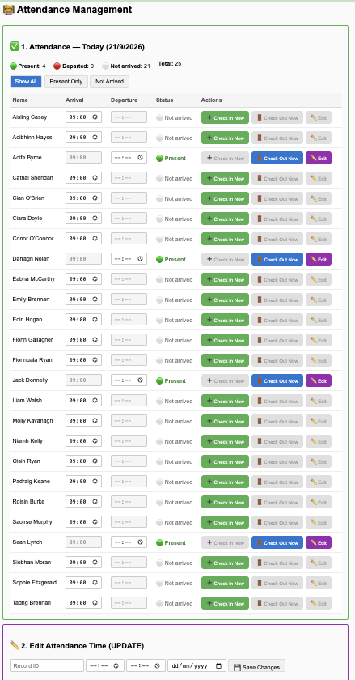
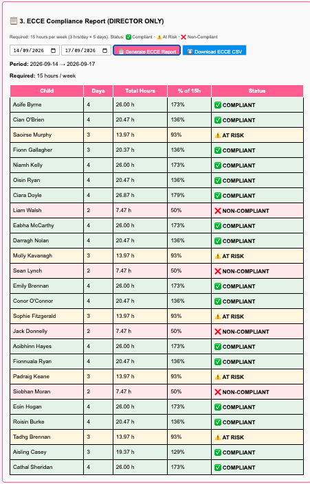
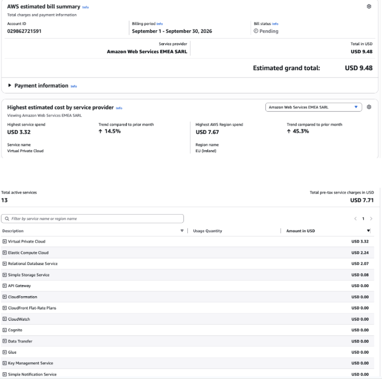
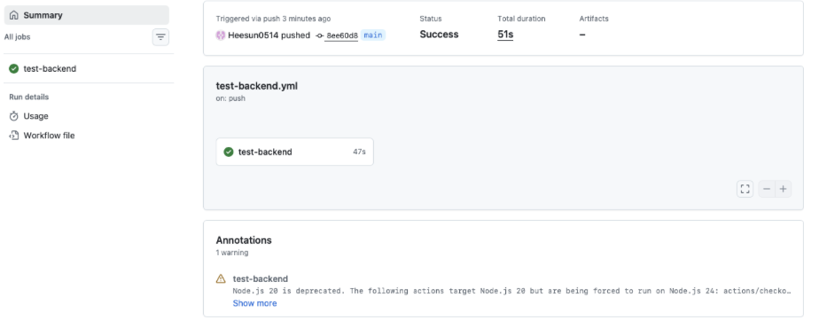
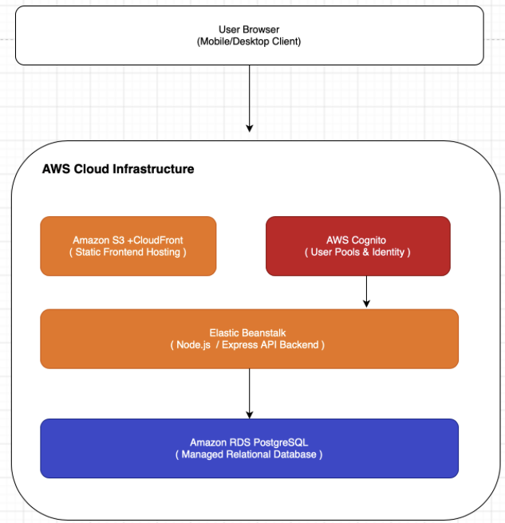

# 🏫 Daycare Digital Logbook — AWS Cloud Migration

A cloud-based attendance and ECCE compliance system for Irish daycare
centres, built with Node.js, PostgreSQL (RDS), Cognito, S3, and CloudFront.

🎥 **[Watch the 5-minute demo](LINK)** — full walkthrough of the app,
the AWS console, and the deployment debugging story.

📄 [API docs](docs/API.md) · 🏗 [Architecture](docs/ARCHITECTURE.md) ·
🔧 [Deployment decisions](docs/DEPLOYMENT.md) · 🐛 [Post-mortem](docs/POSTMORTEM.md)

> **Hosting note:** The frontend is deployed to S3 + CloudFront. The backend
> is containerized (image published to Amazon ECR) and validated against RDS
> locally. Continuous hosting on ECS Express Mode is not enabled because the
> monthly cost (~$20–30) is not justified for a portfolio project. The demo
> video shows the full system working against RDS.

---

## 🎯 What This Is

Tracks daily attendance for 25 children at a daycare centre and generates
ECCE compliance reports (Irish government funding requires ≥ 15 hours/week).


**Why:** Irish daycare centres still rely on paper logbooks. Tusla's 2022 
report found only 50.4% of services fully compliant with regulations, with 
Regulation 23 (health and welfare) at 58.8%. A digital logbook with 
automated compliance reporting addresses the gap.


**Stack:**

| Layer | Tech |
|-------|------|
| Frontend | Vanilla JS on S3 + CloudFront |
| Backend | Node.js 18, Express, Sequelize |
| Database | PostgreSQL 15 on RDS (eu-west-1) |
| Auth | AWS Cognito with Teacher/Director roles |
| Container | Docker → ECR |
| CI | GitHub Actions + Jest |

## ⭐ Highlights

- Migrated 11 children + 3 attendance records from SQLite → RDS without data loss
- Seeded 25 children + 84 records to demonstrate the ECCE report with realistic variation
- Cognito + JWT with role-based access control (Teacher, Director, Parent)
- 17 Jest/Supertest tests running in GitHub Actions CI
- Containerized backend; image published to Amazon ECR
- Tracked AWS costs: ~$24.48 over 3 months
- Tracked AWS costs: **$9.48 for September 2026** ($24.48 over three months); RDS compute stopped when not in use

## 📸 Screenshots

**Teacher view — daily attendance table**


*25 children with live status badges and one-tap Check In / Check Out / Edit buttons.*

**Director view — ECCE compliance report**


*Weekly compliance status against the 15-hour funding threshold.*

**AWS spend — September 2026**


*$9.48 for the month; $24.48 over three months.*

**CI pipeline — GitHub Actions**


*17 Jest/Supertest tests run on every push.*


## 🏗 Architecture



*Original planned architecture — Elastic Beanstalk was the intended backend host. The EB deployment was blocked by a VPC timeout, and the final version uses a Docker container instead. See [docs/POSTMORTEM.md](docs/POSTMORTEM.md).*

**Current validated architecture:**

- Frontend — S3 + CloudFront (as planned)
- Database — RDS PostgreSQL (as planned)
- Auth — AWS Cognito (as planned)
- Backend — Docker container running locally, image published to ECR

The backend runs locally because App Runner (the original deployment target) stopped accepting new customers in April 2026, and the recommended successor (ECS Express Mode) has a ~$20–30/month minimum cost. The Docker image is deployable at any time. See [docs/DEPLOYMENT.md](docs/DEPLOYMENT.md) for the full decision record.


## 🚀 Running Locally

```bash
git clone https://github.com/Heesun0514/Daycare-Digital-Logbook-AWS-Cloud-Migration
cd Daycare-Digital-Logbook-AWS-Cloud-Migration/backend
npm install
# Create .env with DB_HOST, DB_USER, DB_PASSWORD, DB_NAME, COGNITO_*, JWT_SECRET
node server.js
```

Health check: `curl http://localhost:8080/health`

For Docker and cloud deployment: see [docs/DEPLOYMENT.md](docs/DEPLOYMENT.md).

## 🐛 The Debugging Story

My first deployment attempt used Elastic Beanstalk. The app started but
couldn't reach RDS — `ETIMEDOUT` on port 5432. I diagnosed it by checking
VPC configuration, security groups, and subnet routing, evaluated four
remediation paths, and chose to containerize the backend instead of
reconfiguring the VPC.

Full write-up: [docs/POSTMORTEM.md](docs/POSTMORTEM.md).

## 📁 Documentation

| Doc | What's in it |
|-----|-------------|
| [docs/API.md](docs/API.md) | Every endpoint, request/response |
| [docs/ARCHITECTURE.md](docs/ARCHITECTURE.md) | Full diagram, data flow |
| [docs/DEPLOYMENT.md](docs/DEPLOYMENT.md) | Setup, EB options table, post-sprint work |
| [docs/POSTMORTEM.md](docs/POSTMORTEM.md) | EB debugging story |
| [docs/TESTING.md](docs/TESTING.md) | Jest tests, coverage, CI |
| [docs/SECURITY.md](docs/SECURITY.md) | Auth, CORS, known gaps |

## 📄 License

MIT — see [LICENSE](LICENSE).


